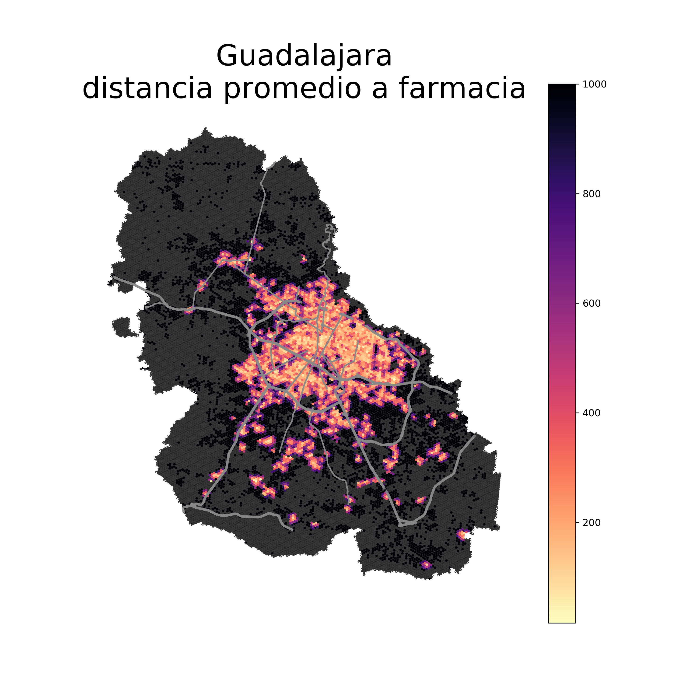

# Observatorio de Ciudades 
_Una iniciativa de la Escuela de Arquitectura, Arte y Diseño del Tecnológico de Monterrey; un espacio que ofrece información actual y útil que permite el análisis, medición y evaluación de las ciudades mexicanas, para incidir en la planeación y la toma de decisiones que contribuirán a mejorar la calidad de vida urbana de las personas._

_Analiza y compara distintas ciudades, integrando bases de datos existentes y generando información propia, para entender las condiciones en el territorio que determinan la calidad de vida urbana. El observatorio de ciudades estudia los entornos a escala barrial/vecinal para comprender dinámicas y factores que condicionan la calidad de vida de las personas._

## Contenido 
1. [Objetivos](#objetivos)
2. [Bases de datos](#bases-de-datos)
3. [Servicios](#servicios)
4. [Contacto](#contacto)

## Objetivos:

**Generar y transferir conocimiento**

>El observatorio busca analizar información de bases de datos oficiales, bigdata y análisis propio a través de tecnologías de vanguardia para evaluar los niveles de inclusión y planeación de ciertas ciudades.

**Impactar en la academia y la investigación**

>A través de las conclusiones derivadas del proyecto buscamos promover la creación de más iniciativas que generen impacto en los usuarios para generar un bienestar que puede ser significativo. La academia y la investigación son dos pilares fundamentales de la innovación y el conocimiento, tanto en la divulgación de temas que representan un papel decisivo en el espacio educativo como en plataformas para fomentar acción dentro de nuestras ciudades.

## Bases de datos 
Se emplean las siguientes herramientas de información geográfica para evaluar indicadores que permitan abordar las problemáticas más relevantes del proyecto. 

[**H3 :**](https://h3geo.org/docs/)
***
Es un sistema de índices geoespaciales que divide el territorio por medio de celdas hexagonales. Cada polígono incluye coordenadas y se permite encontrar límites dentro de cada arista. Calcula de manera coherente los datos demográficos de acuerdo con las coordenadas y dependiendo su área. Los hexágonos representan una forma estandarizada de comparar diferentes partes de la ciudad en parcelas del mismo tamaño.

***
## Métodología
Siendo la principal área de interés la aplicación de tecnologías y métodos geospaciales, se generan algoritmos que permiten calcular distancas desde cualquier punto.

Se divide la ciudad en hexágonos identificando las estructuras urbanas y condiciones de accesibilidad de cada uno.
En cada intersección al interior de la figura se toma el promedio por hexágono y se ofrece un comparativo de las diferentes áreas de la ciudad.

## Cálculos de accesibilidad
Siguiendo las rutas de camino más cortas hacia las amenidades de interés. Se consideró una velocidad promedio peatonal de 3km/hr.
En el siguiente artículo se explica a detalle [Quantifying Life Quality as Walkability on Urban Networks: The Case of Budapest](https://arxiv.org/abs/1912.00893)

[**DENUE:**](https://h3geo.org/docs/)
***
El Directorio Estadístico Nacional de Unidades Económicas (DENUE) ofrece datos cuantitativos, de ubicación y actividad económica de unidades en el territorio nacional.

[**CENSO DEL INEGI:**](https://www.inegi.org.mx/programas/ccpv/2020/default.html#Resultados_generales)
***
Se utilizan los datos más actualizados del  Censo de Población y Vivienda 2020 para analizar las características demográficas, socioeconómicas y culturales.

[**MARCO GEOESTADÍSTICO:**](https://www.inegi.org.mx/temas/mg/#Mapa)

***
El mapa del marco geoestadístico muestra de manera precisa límites estatales y municipales que hacen referencia a establecimientos económicos, viviendas y unidades de producción del país, permitiendo su consulta detallada de cualquier parte del territorio nacional. 

[**PLANETARY COMPUTER :**](https://planetarycomputer.microsoft.com/:)
***
Una Plataforma diseñada para monitorear procesos y datos de manera global en temas ambientales con APIs intuitivos. Dichos recursos muestran imágenes satelitales que permiten utilizar los resultados para un proceso de toma de decisiones más sostenible.

[**OSMnx :**](https://osmnx.readthedocs.io/en/latest/)
***
Fuentes como OpenStreetMap son utilizadas como complemento, la información (VGI) nos da pie a datos relevantes. OSMNx es un paquete para interactuar dentro de Python con información geográfica construida con NetworkX, geopandas y matplotlib para facilitar el análisis y cálculo estadístico espacial.

## Servicios

_El observatorio busca proporcionar servicios de utilidad urbana aportando la experiencia y la evaluación de diferentes herramientas para informar acerca de temas de geolocalización enfocada al urbanismo, mismas que pueden ayudar a diversos sectores a crear ciudades inclusivas._

**Análisis de imágenes satelitales:**
***
Las imágenes son una valiosa fuente de información, pero aprovechar los datos que te brindan puede ser un reto. Usando nuestra experiencia y análisis puedes obtener información detallada y reportes que aprovechan las imágenes del satélite Sentinel 2ª,  a través de Planetary Comp y  el estudio de índices como NDVI, NDMI o temperatura que permiten la identificación de características únicas, para obtener mayores características de territorios dentro de tú área de interés.

**Análisis sociodemográfico: :**
***
La composición de la población y sus procesos demográficos son un factor importante para evaluar el desarrollo de la región. El equipo valida y analiza información sociodemográfica local, regional y nacional de los censos del INEGI mejorando las oportunidades de mercado y cuantificando la demanda de prioridades que utilicen las variables en un enfoque espacial para obtener información territorial de circunstancias, contexto y características de cualquier espacio. 

**Análisis de proximidad: :**
***
Cálculo de distancias a través de la morfología urbana considerada a partir de nodos y aristas viales que se obtienen utilizando OSMx.
Siendo la principal área de interés la aplicación de tecnologías y métodos geoespaciales, se generan algoritmos que permiten calcular distancias desde cualquier punto.

**Visores :**
***
Herramienta tecnológica que permite la consulta de información, así como el análisis dinámico de accesibilidad peatonal en un entorno urbanizado. Basándose en datos subyacentes de hexágonos que identifican las estructuras urbanas y condiciones de accesibilidad de cada figura, por medio de sus intersecciones compara la caracterización sociodemográfica de dicho territorio. Las medidas se basan en un concepto de movilidad denominado como “ciudades de 15 minutos” en donde los servicios y amenidades deberían existir a una distancia menor a 15 minutos. Este es el contraste entre ciudades que se genera para observar con facilidad los desequilibrios urbanos.

## Contacto

[Observatorio de Ciudades](https://observatoriodeciudades.mx/)

[Twitter](https://twitter.com/observacdstec?lang=es)

[Instagram](https://www.instagram.com/observaciudades.tec/)

